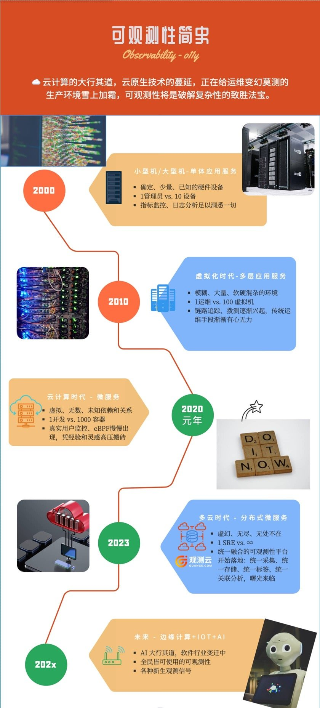
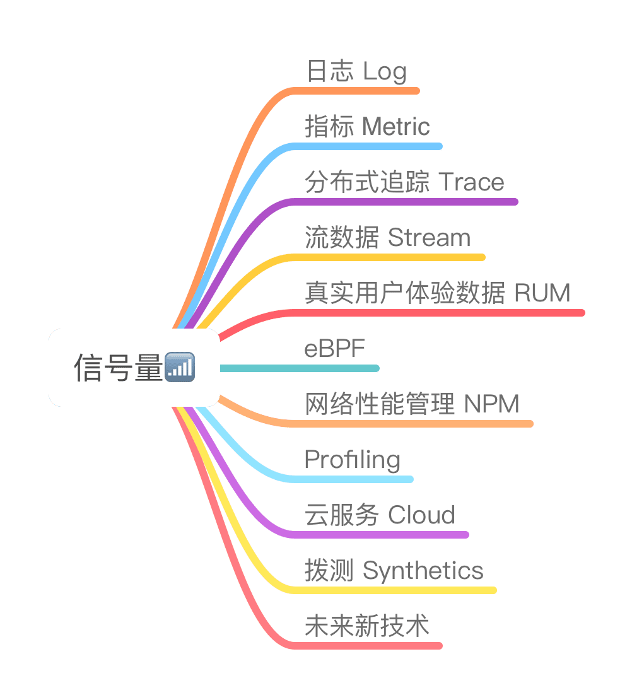

可观测性不是空穴来风，也并非关键词的炒作。大家不妨看一下这个运维管理的演变过程，我们抛开运维管理中关于流程和人的那些繁文缛节。只关注在基础设施和应用架构的变迁，关注于曾经层出不穷的技术工具方面。

## 兼容全域信号量

从遥测的角度看，任何类型的信号都有各自的用途和道理。武断地选取某一种信号作为可观测性的代表是比较偏见的做法，Debug生产环境的道路上难以依靠单一方法。根据不同应用系统的特点和服务类型，选择合理的SLI组合来覆盖目标应用，从构建应用的可观测性角度考虑。明智地选择、添加或变化信号类型，应是有针对性的方法。这里不是越多越好，盲目全面覆盖也是无效的做法；在高维度、高基数的场景中，很容易造成成本飙升，从而稀释有价值的信息点。

所谓全域信号量究竟是那些：

1. **日志 Log**：文本记录系统和应用的活动、事件和错误，提供详细上下文。
2. **指标 Metric**：定量的性能度量，如CPU使用率、请求速率，帮助监控系统状态。
3. **分布式追踪 Trace**：跟踪请求在分布式系统中的路径和性能瓶颈。
4. **流数据 Stream**：实时产生的数据，如用户行为，用于即时监测和分析。
5. **用户体验数据 RUM**：记录用户在应用中的交互、操作和反应，评估体验质量。
6. **eBPF**：扩展 Berkeley Packet Filter，收集内核级别的数据，用于分析和监控。
7. **网络性能管理 NPM**：监测网络带宽、延迟和连接状况，优化网络性能。
8. **Profiling**：分析代码运行时的性能特征，帮助优化应用程序。
9. **云服务 Cloud**：从云提供商获取的监测数据，跟踪资源使用和性能。
10. **拨测数据 Uptime/synthetics**：定期对系统进行外部测试，监测系统在不同地点和条件下的可用性和性能。
11. 未来新技术：未知类型数据。

可观测性管理平台应当以全方位的信号为设计目标。这意味着在观测数据的采集、上传、存储、展示以及关联分析的整个过程中都能正确处理各类数据，更能合理有效地进行关联；在数据下钻的过程中，可以自由地在各种信号之间跳转和进行关联分析。

当然，监测所有已知的“未知”的管理需求，就应当使用某一种信号即可充分满足。而上述讨论是针对管理未知的“未知”，这就需要处理多层级、高依赖、多云环境下、分布式系统的高复杂度，信号的全面和准确往往也只是必要条件。

目前市场上有许多运维管理平台自称为“可观测性”管理平台，但大多数都是从某个特定类型开始，逐渐扩展覆盖更多信号类型。通常能够涵盖3种以上信号类型的平台才能有出色的效果；对于那些已有3至5年历史的‘可观测性’产品，这些平台通常是从某个特定分类信号起家的，所谓术业有专攻，三到五年的时间，很可能使其既不可能华丽的转身，也不可能重头再来。

## 统一采集和上传工具

在物理机的使用仍然处于主流的时代，对于同一个主机，由于其可能承担着多重角色，以及根据不同的管理需求，在其操作系统中可能会安装多种管理监控代理程序Agent，例如：操作系统指标、日志、数据库、中间件、安全巡检等等；这种叠罗汉的形式不仅给操作系统的资源带来了严重的消耗，甚至还给服务器的管理带来了大量的琐事，例如：数据库管理 Agent 还需要创建专用的用户账号等。为了解决这个问题，很多公司使用了尽可能少的单一采集代理的模式，例如：BMC 公司的 Patrol 拥有多种采集模块 KM（数据库、中间、web 服务器等等），用户可以按需要进行配置，而不需要部署多种采集代理程序。然而，BMC 公司会逐渐收购很多新的公司，后来的产品包括动态性能基线管理，自动化配置管理等等。从工具厂商的角度看， 他们无法进行快速整合，很难维持单一采集代理的局面。

从甲方企业用户看来，不同部门会根据自己的需求采购不同的管理工具，部门间的差异导致了工具的重复建设，数据的重复采集，而且数据并不会很轻易的在部门间共享。这样不仅带来了采集工具在同一个主机上的叠加部署，还会导致：独立的运行着大量具有重复数据的运维数据孤岛数据库。这种局面进一步导致了，同一个主机的同一个故障会在各种工具中触发的多条告警事件；从而造成事件风暴。这种混乱的局面，给 AIOps 的工具带来了生存的空间，即使可以产生一些事件收敛和压缩的收效，但很明显的错误是：治标不治本。

在虚拟化到云原生时代中，以上局面并没有带来根本性的变化。反而带来了套娃式深层依赖关系的困境。我们不会把 web、中间件、数据库、消息队列等功能跑在一个 POD 中，但是将其各自独立部署后，带来了管理对象成指数上升的状况。容器时代带来的新鲜监控工具包括Prometheus、Grafana、FluntD、Graphite、cAdvisor、Loki、EFK等等。我们可以观察到，新生的工具并不会完全改变：多种采集功能代理并存的局面。Elastic 看到了多种相似代理程序的缺点，最近几年很快的将之前的多种 Beats 程序（多次收购的项目）整合成一个统一代理 Elastic Agent，而这个程序目前还只是多个 Beats 程序的马甲（包装壳）程序。Zabbix 是一个依然长期存在的常见采集代理，我并不排除在容器环境中，容器内用云原生监控工具集，容器外依然使用老牌监控工具的组合的普遍存在性。

多种采集工具集不仅在端点上造成了更多的部署和配置的琐事，更重要的是：后台不得不对应多种数据库部署。同一个管理对象在不同的数据库中字段描述不一致将会导致：很难在各类数据库中实现关联分析。CMDB 是可能的解决之道，而 CMDB 的设计和建设难度不亚于任何一个监控项目本身，这个方案的实现难度太大，成本太高。而在这些运维数据库集合之间做 ELT，做数据治理，让信息归一化的工作量是一个顺坡下驴的无奈之举，但更包含这将计就计的辛酸。

貌似最早由 Elastic 推出的统一数据模型（ECS）<https://www.elastic.co/cn/elasticsearch/common-schema> 是一个数据走向标准化定义的可行之道，也看到了：OpenTelemetry 项目很快的采纳了 Elastic ECS。CNCF 在随后也推出了相似的观测数据定义模型，我相信 CNCF 也看到了在它的技术蓝图中，可观测性和分析分类中相似同类工具的快速繁荣。而这些标准只能让我们望梅止渴，目前还没有看到多数厂商、大量开源项目快速的跟随和兼容的局面。

观测云的 DataKit 是一款多功能的采集代理程序，它具解决上述问题的构思，已经在兼容和对接更广泛的技术生态系统。采集或者对接到了目标数据之后，其实还需要处理一些列的细节，否则我们 任然无法实现“源头治理”，无法避免“garbage in gargage out”的窘境。首先，DataKit 在组织封装数据的时候，所有字段的定义遵从着一个观测云自定义的数据字典（等同于 Elastic ECS ）；其次，上报数据包在封包前，还能做数据的 Pipline 处理，实现了数据丢弃、质量、治理和脱敏等问题。最后，DataKit 的采集还可实现对接开源&闭源生态系统，例如接收 DataDog 的 APM 探针数据，对接 OpenTelemetry 的数据等等。还能实现网际，网络间的转发等。

## 统一的存储后台

在可观测性的场景中，每种类型的型号量都应得到它最佳的容身之处，因此多种数据库百花齐放的局面出现了：

* Elasticsearch ：在 Elastic 的 ECS 的加持之下，貌似它是一个很恰当的一库存所有的方案，但前提是你需要能 hold 住性价比。
* 时序数据库：不一一列举，适合指标类时序数据。
* 列数据库：以 ClickHouse 为代表的实时数据分析的列数据库，可兼容多种信号。
* 关系型数据库：WHY NOT。

从数据入库的角度看，给每种信号量配置其最佳的数据库类型，貌似是一个皆大欢喜的局面。这也不辜负，目前各种开源数据库百花齐放的形势。

略过上面已经提到的数据孤岛和治理问题不谈。从查询的角度看，用户将不得不学会多种查询语言，前方有 n 中 SQL 语法需要你学习，否则你不得不开发维护一个一对多的查询界面。这里我们暂且不分析如何实现扩库的数据关联。

问题：是否存在一种多模态的统一数据库，将多种类型的信号量数据融入一个统一的数据仓库？

实际上，目前的可观测性 SaaS 提供商们，已经给他们的用户提供了这样一种统一融合的数据后端，起码从查询探索可观测性数据的使用体感的角度上，确实是已经做到了。而观测云也正在推出这样一款解决以上统一融合多态并存管理需求的数据库。观测云用户很快将在 SaaS服务中，和私有部署的产品上使用到这种技术。

## 自由探索和综合使用可放大数据价值

在考虑到可观测性数据使用场景的时候，我强烈大家利用“第一性原理”来思考。这样才能避免对经验的依赖，排除对新可观测性技术能平替所有旧技术的单纯幻想，能回到可观测性的概念本源。

此处省略 x 百字，仅以上图与读者们一起随时随刻的校准“可观测性”的定义。

## 总结

本文从四个层面对可观测性的实现做了一定深度和时间跨度上的探讨。希望：一个统一融合的可观测性平台在您的工作环境中可以很快落地。穿上两只靴子后的你，可以脱离以前赤脚救火的困境。希望可观测性能帮助到软件交付流水线中的所有人，运用它来补Ops的锅，助SRE的威，壮Dev胆。
