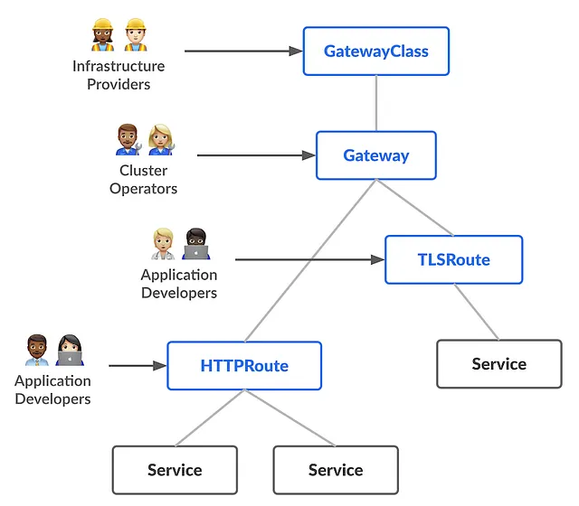

对于每一位踏入 Kubernetes 世界的 DevOps 工程师来说，Ingress 通常是他们遇到的第一个资源，甚至可能是他们的“初恋”。当需要简单的 HTTP(S) 路由时，Ingress 就会派上用场，为集群内部的服务打开了通往外部世界的大门。多年来，它一直运行良好。但技术世界永不停歇，需求不断演变，现有解决方案也开始触及其局限性。正是在这种背景下，Gateway API 进入了 Kubernetes 生态系统。

那么，既然我们已经有了像 Ingress 这样成熟且广泛采用的解决方案，为什么还需要一个新的 API 呢？Gateway API 解决了哪些问题？它缓解了哪些痛点？在这篇博客文章中，我们将探讨我使用 Ingress 的经验、Gateway API 带来的创新，以及为什么这种转变是完全合理的。我们的目标是以技术性强但友好的语调来解释这些内容。

## Ingress 的局限性

**注解地狱 (Annotation Hell)：** Ingress 最大的缺点之一是它对注解 (annotations) 的依赖，以实现高级功能。对于限流 (rate limiting)、URL 重写 (URL rewrites)、请求体大小限制 (body size limits)、CORS 设置 (CORS settings) 等类似功能，我们不得不使用每个 Ingress 控制器 (Ingress Controller) 特定的注解。这导致了不同 Ingress 控制器（Nginx、Traefik、HAProxy 等）之间的不一致性。您在使用 Nginx Ingress 时编写的注解，在切换到 Traefik 后可能会变得毫无意义。当然，如果您像我一样通常只使用 Nginx Ingress，这可能对您来说不是问题，但未来您可能需要替代方案。

**缺乏高级流量管理：** Ingress 自身不足以支持现代部署策略，例如金丝雀部署 (canary deployments) 和蓝绿部署 (blue/green deployments)。这些场景通常需要额外的工具，比如服务网格 (Service Mesh) 或复杂的注解组合。这增加了架构的复杂性和运维开销 (operational overhead)。

**协议限制：** Ingress 从根本上是为 HTTP 和 HTTPS 流量设计的。它没有内置支持其他协议，如 TCP 和 UDP。这使得在 Kubernetes 上运行使用不同协议的应用程序时，需要寻找替代解决方案。

## 为什么选择 Gateway API？Kubernetes 流量管理的新时代

考虑到 Ingress 的局限性，Kubernetes 社区认识到需要一种更全面、更灵活的流量管理解决方案。Gateway API 应运而生。Gateway API 不仅支持 HTTP(S) 流量，还支持 TCP 和 UDP 等其他协议。它提供了一个基于角色且可扩展的结构。让我们深入了解 Gateway API 的核心组件以及它解决的问题：

Gateway API 围绕三个主要的自定义资源定义 (Custom Resource Definitions, CRDs) 构建：

**GatewayClass：** 该资源定义了网关 (Gateway) 的行为和功能。就像 Ingress Controllers 一样，不同的 Gateway Controllers (例如 NGINX Gateway) 提供自己的 GatewayClass。

**Gateway：** 该资源表示集群中的一个网络网关，通常是一个负载均衡器或代理。它定义了监听器 (listeners)，并指定哪些路由 (Route) 对象可以附加到这些监听器。例如，一个 Gateway 对象可能在 80 端口和 443 端口监听 HTTP 和 HTTPS 流量。

**Route：** Route 资源定义了到达 Gateway 的流量应如何路由。HTTPRoute 用于 HTTP/HTTPS 流量，而 TCPRoute 和 UDPRoute 等其他类型则用于不同的协议。路由根据主机 (host)、路径 (path)、请求头 (headers) 等匹配流量，并将其路由到后端服务 (backend services)。这是开发人员可以定义自己的路由规则的地方。



这种三层结构完美地实现了 Gateway API 最重要的创新之一：关注点分离 (separation of concerns)。

**基础设施提供商 (Infrastructure Providers)：** 管理 GatewayClass 并决定可以使用哪些 Gateway Controllers。

**集群操作员 (Cluster Operators)：** 创建和管理 Gateway 对象。这包括面向公众的配置、监听器和基本的安全设置。

**应用程序开发人员 (Application Developers)：** 为其应用程序定义 Route 对象，例如 HTTPRoute。这些规则包括基于主机/路径/请求头的路由、流量拆分 (traffic splitting) 和重写 (rewrites)。

## 实践示例

假设我们有以下 Ingress 资源，它通过 k8senol.com 根据路径将流量路由到两个服务（message-service 和 swap-service）：

```yaml
apiVersion: networking.k8s.io/v1
kind: Ingress
metadata:
  name: oldfriend-ingress
  annotations:
    nginx.ingress.kubernetes.io/rewrite-target: /
spec:
  rules:
  - host: k8senol.com
    http:
      paths:
      - path: /message
        pathType: Prefix
        backend:
          service:
            name: message-service
            port:
              number: 80
      - path: /swap
        pathType: Prefix
        backend:
          service:
            name: swap-service
            port:
              number: 80
```

现在，让我们使用 Gateway API 通过三个步骤（GatewayClass、Gateway 和 HTTPRoute）来实现相同的场景。

**第一步：** 定义 GatewayClass 首先，我们需要创建一个 GatewayClass 来指定将使用的 Gateway Controller。

```yaml
apiVersion: gateway.networking.k8s.io/v1
kind: GatewayClass
metadata:
  name: k8senol-gw-class

spec:
  controllerName: k8senol.com/gateway-controller
```

这个 YAML 定义了一个由 k8senol.com/gateway-controller 控制器管理的网关类 (GatewayClass)。在实际应用中，这个值会是你所使用的网关控制器 (Gateway Controller) 的具体名称（例如，gateway.nginx.org/nginx-gateway-controller）。

**第二步 Step 2: 创建网关 (Gateway)**
接下来，我们将创建网关 (Gateway) 资源，它将集群暴露给外部流量，并定义要监听的端口和协议。

```yaml
apiVersion: gateway.networking.k8s.io/v1
kind: Gateway
metadata:
  name: k8senol-gateway
  namespace: default
spec:
  gatewayClassName: k8senol-gw-class
  listeners:
  - name: http
    protocol: HTTP
    port: 80
    hostname: "*.k8senol.com"
    allowedRoutes:
      namespaces:
        from: Same
```

这个网关 (Gateway) 对象使用 k8senol-gw-class 监听端口 80 上的 HTTP 流量。主机名 “\*.k8senol.com” 允许该域下的所有子域名进行路由。allowedRoutes 部分限制路由 (Route) 附件只能在同一命名空间（默认）中。

**第三步: 创建 HTTP 路由 (HTTPRoute)**
最后，我们使用 HTTP 路由 (HTTPRoute) 对象来定义路由规则。

```yaml
apiVersion: gateway.networking.k8s.io/v1
kind: HTTPRoute
metadata:
  name: k8senol-routes
  namespace: default
spec:
  parentRefs:
  - name: k8senol-gateway
  hostnames:
  - "k8senol.com"
  rules:
  - matches:
    - path:
        type: PathPrefix
        value: /message
    backendRefs:
    - name: message-service
      port: 80
  - matches:
    - path:
        type: PathPrefix
        value: /swap
    backendRefs:
    - name: swap-service
      port: 80
```

这个 HTTP 路由 (HTTPRoute) 对象附加到 k8senol-gateway。hostnames 字段将这些规则应用于 k8senol.com。rules 部分复制了 Ingress (Ingress) 的路由逻辑：/message 路由到 message-service，/swap 路由到 swap-service。

如你所见，单个 Ingress YAML 现在在 Gateway API 中被拆分为三个不同的资源。虽然这最初看起来更复杂，但每个资源都有明确的职责。从长远来看，这会带来更清晰、更易管理且更安全的流量管理架构。

Kubernetes Ingress 毫无疑问是 Kubernetes 生态系统的基石，在将服务暴露给外部世界方面发挥了关键作用。凭借其简单易懂的结构，它在早期阶段为我们提供了良好的服务。但随着技术发展和需求变得日益复杂，对灵活强大解决方案的需求也随之增长。

Gateway API 应运而生，以应对 Ingress (Ingress) 的局限性，并将 Kubernetes 流量管理提升到一个全新的水平。凭借角色分离、可扩展性、多协议支持和高级流量控制能力，它能更有效地满足现代云原生应用的需求。

这不仅仅是技术上的变革。它也反映了我们对 Kubernetes 中网络认知的转变。从今天开始探索 Gateway API 是朝着构建更强大、更灵活、更易管理的基础设施迈出的有意义的一步。

请记住，持续学习和适应是 DevOps (DevOps) 世界成功的关键。这次转型不仅会提升你的技术技能，还会提高你理解和管理复杂系统的能力。
